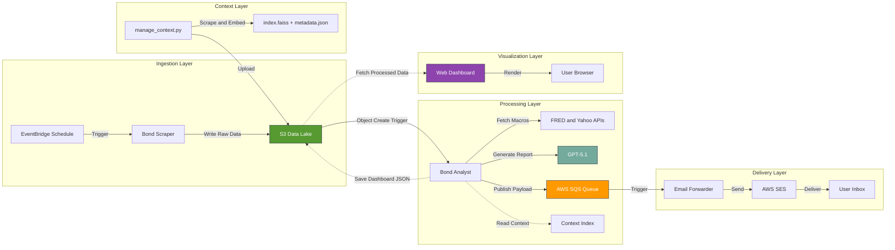

# 📉 Serverless AI Bond & Equity ETF Analyst


An automated, event-driven financial dashboard that scrapes market data, performs quantitative regression analysis, and uses GPT-5.1 to generate "CIO-style" daily strategy reports.

## 🏗️ Architecture

This project uses a **Serverless Microservices Architecture**, now fully managed via **AWS SAM (Serverless Application Model)** for robust Infrastructure-as-Code (IaC) deployment.

**The Pipeline:**

1. **Ingestion (BondDataScraper):** A scheduled Python Lambda scrapes daily yield/duration data for ETFs and stores it in an **S3 Data Lake**.
2. **Analysis (BondAnalyst):** An **S3 Event Trigger** wakes the Analyst Lambda. It fetches live macro data (FRED API), calculates yield curve anomalies, and prompts **GPT-5.1** to generate a written market summary.
3. **Chatbot (ChatAnalyst):** A RAG-enabled Lambda provides a conversational interface to the market data, secured by **Email-Based Access Control**.
4. **Delivery (EmailForwarder):** A final Lambda consumes an SQS Queue to deliver reports via **AWS SES** (decoupled for reliability).
5. **Visualization:** A static HTML/JS dashboard hosted in S3 (served via **CloudFront**) fetches the raw data to render interactive charts.

## 🛠️ Tech Stack

* **Cloud:** AWS SAM (managing Lambda, S3, SQS, SES, EventBridge, IAM)
* **Language:** Python 3.12 (Analyst/Chat), Python 3.10 (Mailer/Scraper)
* **Security:** Cognito (Frontend Auth) + S3 Allowlist (Chat Backend Auth)
* **AI:** OpenAI GPT-5.1 (Structured Outputs)
* **Frontend:** HTML5, CSS3, Chart.js, CloudFront CDN

## ⚡ Quick Start

### Prerequisites

* AWS CLI installed and configured
* AWS SAM CLI installed
* Docker (optional, for local builds)

### 1. Deployment

The entire backend stack is defined in `template.yaml`. Deploy it with a single command:

```powershell
.\deploy.ps1
```

This script handles:

* Clearing build artifacts
* Building the SAM application (using containers if needed)
* Deploying the CloudFormation stack (`sam-app`)

### 2. Frontend Setup

1. Upload the frontend code to your S3 bucket:
   ```powershell
   aws s3 cp frontend/index.html s3://your-bucket-name/index.html
   ```
2. Invalidate CloudFront cache (to see changes immediately):
   ```powershell
   aws cloudfront create-invalidation --distribution-id YOUR_DIST_ID --paths "/index.html"
   ```

### 3. Access Control (Chatbot)

The Chat Analyst is secured to specific subscribers.

1. Edit `infrastructure/subscribers.json` to add authorized emails.
2. Upload to S3:
   ```powershell
    aws s3 cp infrastructure/subscribers.json s3://your-bucket-name/infrastructure/subscribers.json
    ```

### 4. Managing the RAG Knowledge Base

The chatbot's intelligence comes from a **Retrieval-Augmented Generation (RAG)** system that uses curated articles as context. You manage this knowledge base locally using the `manage_context.py` CLI tool.

#### Prerequisites

```powershell
# Install dependencies (run once)
pip install boto3 numpy requests beautifulsoup4 python-dotenv

# Set your OpenAI API key (for embeddings & metadata extraction)
# Create a .env file with: OPENAI_API_KEY=sk-your-key
```

#### Commands

| Command | Description |
|---------|-------------|
| `add`   | Add a new document via URL, file, or manual paste |
| `list`  | List all articles in the knowledge base |
| `view`  | View the full content of a specific article |
| `delete`| Remove an article from the knowledge base |

#### Usage Examples

```powershell
# Add an article by scraping a URL
python manage_context.py add --url "https://example.com/article"

# Add an article from a local text file
python manage_context.py add --file "C:\path\to\article.txt"

# Add an article by pasting text manually (end input with Ctrl+Z on Windows)
python manage_context.py add

# List all articles in the corpus
python manage_context.py list

# View a specific article by its ID
python manage_context.py view abc12345

# Delete an article by its ID
python manage_context.py delete abc12345
```

#### How It Works

1. **Scrape/Import**: The tool fetches content from URLs (with smart metadata extraction via JSON-LD, meta tags, or AI fallback) or reads local files.
2. **Enrich**: You're prompted to validate/correct the extracted Title, Author, and Published Date.
3. **Embed**: OpenAI's `text-embedding-3-small` model generates vector embeddings for semantic search.
4. **Sync**: The updated `metadata.json`, `embeddings.json`, and `keywords.json` files are uploaded to S3 (`context/` prefix) for the Analyst Lambda to use.

> [!TIP]
> Re-running `add` with the same URL will **update** the existing entry instead of creating a duplicate.

## 🚀 Key Features

* **Infrastructure as Code:** Fully reproducible stack via AWS SAM.
* **Secure Chat:** Hybrid authentication using Cognito (Frontend) and S3-based Allowlist (Backend).
* **Self-Healing:** SQS queues ensure email delivery even if SES is temporarily down.
* **Smart RAG:** Self-feeding knowledge base that learns from its own daily reports.

## 🛠️ Troubleshooting & Tips

- If the frontend shows "Report pending for today.", verify the object `reports/ai_analysis_YYYY-MM-DD.json` exists in your bucket and is publicly readable (or accessible via CloudFront).
- If the Analyst Lambda is triggered multiple times, ensure the S3 trigger suffix is set to `upload_complete.json` and that your scraper writes exactly one completion object per run.
- For Cognito: ensure the App Client's redirect URI matches `REDIRECT_URI` and that `response_type=code` is enabled for the app.
- If emails are not delivered, check SES sandbox limits and verify both sender and recipient email addresses.
- Add CloudWatch logs and set the Lambda role to allow `logs:CreateLogGroup` and `logs:CreateLogStream` for troubleshooting.

---

## 📈 Architecture Diagram


