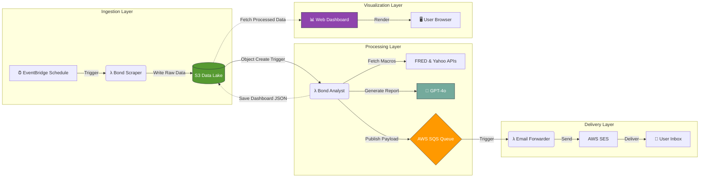

# 📉 Serverless AI Bond and Equity ETF Analyst

An automated, event-driven financial dashboard that scrapes bond market data, performs quantitative regression analysis, and uses GPT-4o to generate "CIO-style" daily strategy reports.

## 🏗️ Architecture
This project uses a **Decoupled Microservices Architecture** to ensure reliability and scalability.
(See the Mermaid diagram below for visual flow)

**The Pipeline:**
1.  **Ingestion:** A Python Lambda scrapes daily yield/duration data for ETFs (HYG, IEI, IWM) and stores it in an **S3 Data Lake**.
2.  **Analysis:** An **S3 Event Trigger** wakes the Analyst Lambda. It fetches live macro data (FRED API), calculates yield curve anomalies, and prompts **GPT-4o** to generate a written market summary.
3.  **Reliability Buffer:** instead of sending emails directly (which is prone to failure), the system pushes a JSON payload to an **SQS Queue**.
4.  **Delivery:** A final Lambda consumes the queue and delivers the report via **AWS SES**.

## 🛠️ Tech Stack
* **Cloud:** AWS (Lambda, S3, SQS, SES, EventBridge, IAM)
* **Language:** Python 3.10
* **AI:** OpenAI GPT-4o (via API)
* **Data:** FRED (Federal Reserve Economic Data), Yahoo Finance
* **Concepts:** Infrastructure as Code, Event-Driven Architecture, ETL Pipelines

## 🚀 Key Features
* **Self-Healing:** If the email service fails, messages persist in SQS for retry.
* **Cost Efficient:** Runs entirely on AWS Free Tier.
* **Automated:** Zero manual intervention required; runs on a daily cron schedule.

## 🔧 Deployment & Configuration

### 1. The Infrastructure
1.  **S3 Bucket:** Create a bucket (e.g., `bond-analyst-data`) and upload `infrastructure/portfolio_config.json` to the root.
2.  **SQS Queue:** Create a standard queue named `BondAnalystAlertsQueue`. Copy its URL.
3.  **SES:** Verify your sender and recipient email addresses in the AWS SES Console.

### 2. The Functions
Deploy the code from `/functions` to 3 separate AWS Lambdas (Runtime: Python 3.10).

**A. Bond Scraper (`/functions/scraper`)**
* **Environment Var:** `BUCKET_NAME` = your-bucket-name
* **Trigger:** Go to EventBridge > Scheduler. Create a schedule to run this Lambda every weekday at 12:00 PM (`cron(0 17 ? * MON-FRI *)`).

**B. Bond Analyst (`/functions/analyst`)**
* **Environment Vars:** * `BUCKET_NAME` = your-bucket-name
    * `SQS_QUEUE_URL` = your-sqs-queue-url
    * `FRED_API_KEY` = your-key
    * `OPENAI_API_KEY` = your-key
* **Trigger:** Add an **S3 Trigger** to this function.
    * Event Type: `All object create events`
    * Prefix: `data/`
    * Suffix: `.json`
    * *Note: This ensures the Analyst runs automatically the moment the Scraper saves new data.*

**C. Email Forwarder (`/functions/mailer`)**
* **Environment Vars:**
    * `SENDER_EMAIL` = verified-sender@example.com
    * `TARGET_EMAIL` = your-email@example.com
* **Trigger:** Add an **SQS Trigger**. Select `BondAnalystAlertsQueue`.
    * *Note: This creates the listener that fires the email immediately upon message receipt.*

### 3. Permissions (IAM)
Each function needs specific rights. See `/infrastructure/iam_policies.json` for the exact JSON policies to attach to each Lambda's Execution Role.

